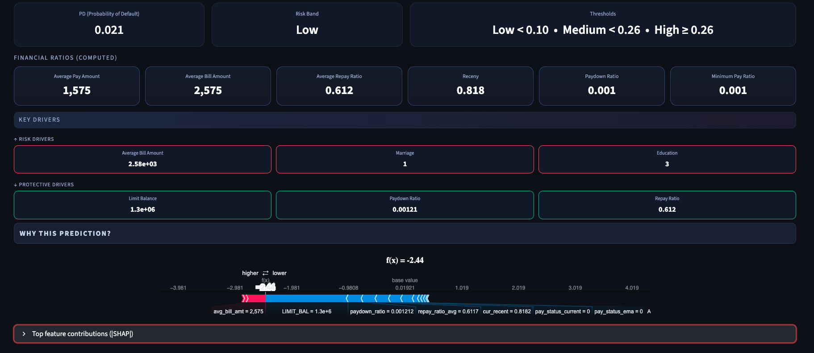
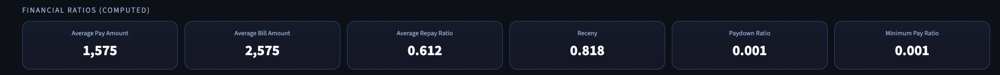
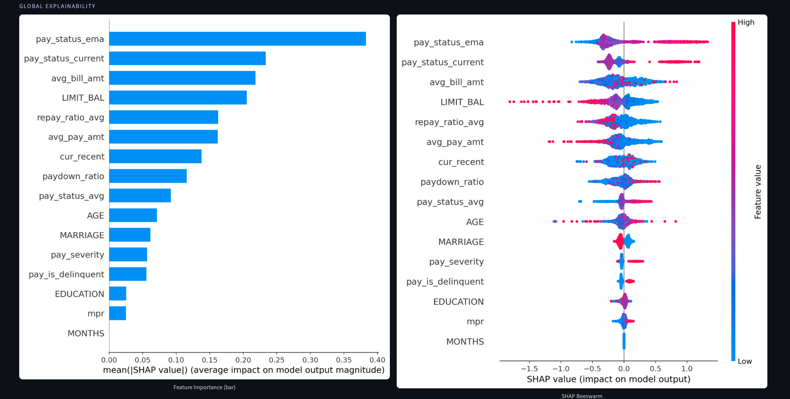

# 🧭 Credyte — Prediction & Explainability

**Credyte** is a risk analytics app that predicts credit default probability and explains every decision with **SHAP values**.  
Built with **Streamlit**, it combines calibrated ML models, financial ratio engineering, and crisp visual explainability into a modern dark-themed dashboard.  

---

## ✨ Features

- 🔮 **Calibrated Predictions**  
  Probability of Default (PD) scored via Logistic Regression / XGBoost / LightGBM.  

- 📊 **Dynamic Ratios**  
  Automatically computed metrics: repayment ratio, paydown ratio, recency, MPR, and more.  

- 🧩 **Explainability First**  
  Individual explanations via SHAP force plots + waterfall views.  
  Global feature importance with SHAP summary plots.  

- 🎨 **Dark UI**  
  Custom styled Streamlit with centered SHAP visuals, pill-style drivers, KPI cards, and responsive grids.  

- 🛠 **Modular Code**  
  Clean feature pipeline (`src/features.py`) and model artifacts under `models/`.  

---

## ⚡ Quickstart

1. Clone this repo:
   ```bash
   git clone https://github.com/yourusername/credyte.git
   cd credyte
```

2. Install dependencies:

    ```bash
   pip install -r requirements.txt
   ```

3. Run the app:

   ```bash
   streamlit run app.py
   ```

4. Open [http://localhost:8501](http://localhost:8501)

---

## 🧮 How It Works

1. **Input minimal borrower info**:

   * Credit limit, Age, Education, Marital status
   * Latest PAY / BILL / PAY\_AMT
   * Prior averages

2. **Feature Engineering** (auto-computed):

   * PAY EMA (trend), PAY average, Updated averages
   * Repay ratio, Paydown ratio, MPR, Recency

3. **Prediction**:

   * Model predicts **PD**
   * Banding into Low / Medium / High risk

4. **Explainability**:

   * Top 3 ↑ Risk Drivers 🔺
   * Top 3 ↓ Protective Drivers 🛡
   * Force plot (centered & scaled)

---

## 📷 Screenshots

### 🔮 Prediction



### 📊 Ratios



### 🧩 SHAP Explainability



---
## 🛡 Tech Stack

* [Python 3.11+](https://www.python.org/)
* [Streamlit](https://streamlit.io/)
* [scikit-learn](https://scikit-learn.org/)
* [SHAP](https://shap.readthedocs.io/)
* [XGBoost](https://xgboost.readthedocs.io/) / [LightGBM](https://lightgbm.readthedocs.io/)
* [Matplotlib](https://matplotlib.org/)
---

## 📜 License

MIT License © 2025 \Anoushka Nahata
---

## 💡 Acknowledgements

* Credit card default dataset inspiration from UCI.
* SHAP for model explainability.
* Streamlit for making ML apps easy to build & beautiful.

---
