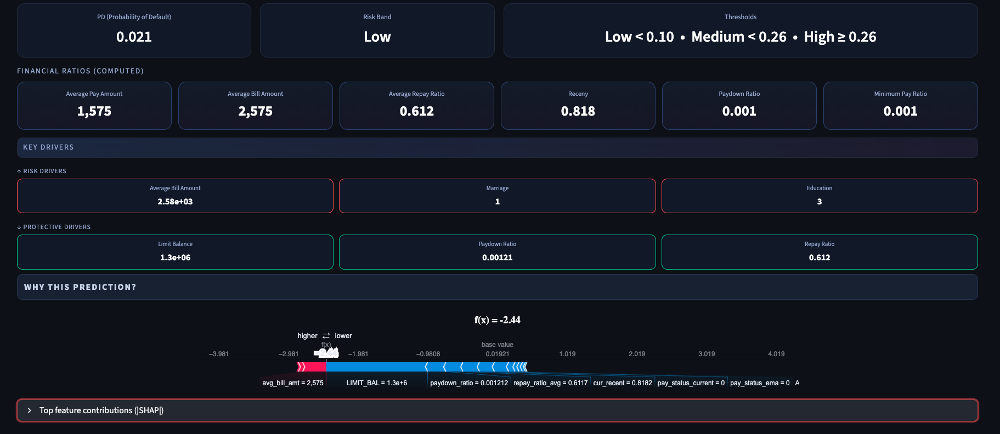
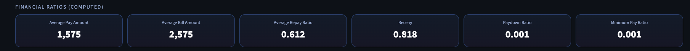
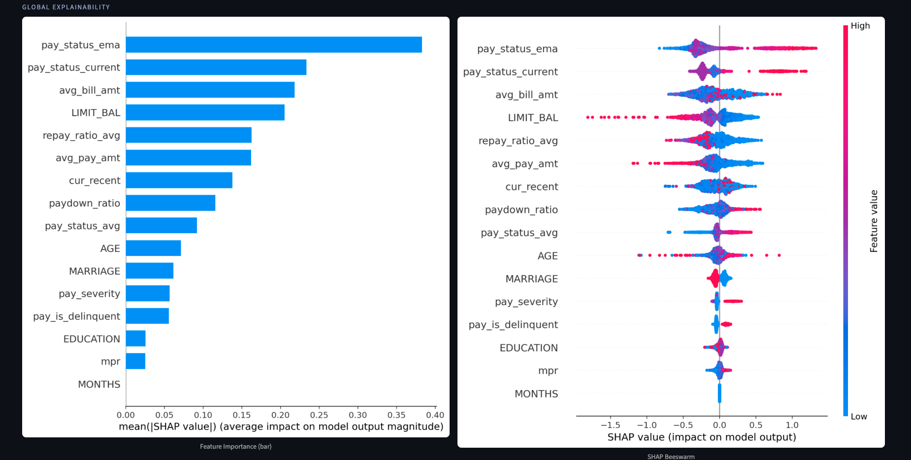

# ⬡ Credyte — Credit Risk Analytics

**Credyte** is an end-to-end credit risk intelligence platform built with Python and Streamlit. It predicts each borrower's **Probability of Default (PD)** using a calibrated XGBoost model, decomposes every prediction with **SHAP**, and tracks key financial health ratios — all inside a modern dark-themed dashboard.

---

## ✨ What's Inside

| Feature | Details |
|---|---|
| **Calibrated PD Scoring** | XGBoost → Isotonic calibration. Scores are true probabilities, not just ranks. |
| **Risk Banding** | Borrowers sorted into Low / Medium / High bands with configurable thresholds. |
| **Financial Ratio Engine** | 6 auto-computed ratios: credit utilisation, payment coverage, paydown rate, payment trend, and more. |
| **SHAP Waterfall** | Per-borrower explanation — shows exactly which features raised or lowered the score and by how much. |
| **Global Explainability** | SHAP bar + beeswarm summary plots across the full portfolio. |
| **Calibration Diagnostics** | Reliability diagrams + metric table comparing Uncalibrated vs Platt vs Isotonic. |
| **Dark UI** | Custom CSS with gradient hero, risk gauge meter, driver cards, and responsive grids. |

---

## 📷 Screenshots

### Prediction & Risk Gauge


### Financial Ratios


### SHAP Explainability


---

## ⚡ Quickstart

```bash
# 1. Clone
git clone https://github.com/Anou-shka/credyte.git
cd credyte

# 2. Create and activate virtual environment
python -m venv venv
source venv/bin/activate        # Windows: venv\Scripts\activate

# 3. Install dependencies
pip install -r requirements.txt

# 4. Run
streamlit run app.py
```

Open [http://localhost:8501](http://localhost:8501).

> **Pre-trained models are included** in `models/`. Skip to step 4 if you just want to run the app.

---

## 🧮 How It Works

### 1 — Input

Enter minimal borrower information in three sections:

| Section | Fields |
|---|---|
| Borrower Profile | Credit limit, Age, Education, Marital status |
| Latest Month | Payment status code, Payment amount, Bill amount |
| Prior History | Running averages for pay/bill amounts and prior pay status |

### 2 — Feature Engineering (`src/features.py`)

17 features are auto-computed from those inputs:

| Feature | Formula | What it captures |
|---|---|---|
| `credit_utilization` | avg_bill / limit_bal | How much credit is actively being used |
| `repay_ratio_avg` | avg_pay / avg_bill | Consistency of full repayment |
| `cur_recent` | latest_pay / latest_bill | Most recent month's payment coverage |
| `paydown_ratio` | avg_pay / limit_bal | Aggressiveness of balance paydown |
| `payment_trend` | (latest_pay − prior_avg) / prior_avg | Is payment behaviour improving? |
| `pay_status_ema` | EMA of pay codes | Smoothed delinquency trend |
| `pay_severity` | pay_code / 8 | Normalised lateness severity |

### 3 — Model Pipeline (`src/train.py`)

```
Raw CSV → Feature Engineering → Train/Test Split (80/20)
       → Logistic Regression (baseline)
       → XGBoost (best by ROC-AUC)
       → Save models/best.joblib + models/baseline.joblib
```

### 4 — Calibration (`src/calibrate.py`)

```
best.joblib → Held-out calibration split
           → Platt scaling (sigmoid logistic)
           → Isotonic regression
           → Pick best by Brier score
           → Save models/calibrated_best.joblib
           → Pick operating threshold by F1
```

### 5 — Explainability

- **SHAP TreeExplainer** on the uncalibrated XGBoost model (stable, exact values)
- **Waterfall plot** — per-prediction breakdown from baseline E[f(x)] to f(x)
- **Key driver cards** — top 3 risk-raising and risk-reducing features for the borrower

---

## 📊 Model Performance

> Evaluated on held-out test set (5,833 samples, 29,163 total).

| Model | ROC-AUC | PR-AUC |
|---|---|---|
| Logistic Regression (baseline) | 0.7583 | — |
| XGBoost (uncalibrated) | **0.7727** | 0.5615 |
| XGBoost + Isotonic calibration | 0.7727 | 0.5615 |

| Calibration metric | Value |
|---|---|
| Brier Score (post-calibration) | **0.1134** |
| Log-Loss (post-calibration) | **0.3598** |
| Operating threshold (F1-optimal) | **0.25** |
| F1 at threshold | **0.629** |

---

## 🗂 Project Structure

```
credyte/
├── app.py                    # Streamlit dashboard
├── src/
│   ├── features.py           # Feature engineering pipeline
│   ├── train.py              # Model training (LR + XGBoost)
│   ├── calibrate.py          # Platt / Isotonic calibration
│   ├── score.py              # Batch scoring utility
│   └── explain.py            # Pre-compute global SHAP images
├── models/
│   ├── best.joblib           # Best uncalibrated model
│   ├── baseline.joblib       # Logistic regression baseline
│   ├── calibrated_best.joblib
│   ├── feature_columns.txt   # Feature schema (17 features)
│   ├── metrics.json          # Training metrics
│   ├── calibration_metrics.json
│   └── operating_point.json
├── data/
│   ├── final_dataset.csv     # Cleaned training data
│   └── financial_ratios.csv
├── images/
│   ├── shap/                 # Pre-computed global SHAP plots
│   └── calibration/          # Reliability diagrams
└── requirements.txt
```

---

## 🔄 Retrain from Scratch

```bash
# 1. Train (outputs models/best.joblib + baseline.joblib)
python -m src.train --input data/final_dataset.csv

# 2. Calibrate (outputs models/calibrated_best.joblib)
python -m src.calibrate --input data/final_dataset.csv

# 3. Pre-compute global SHAP images (optional, speeds up the app)
python -m src.explain
```

---

## 🛡 Tech Stack

| Layer | Library |
|---|---|
| Dashboard | [Streamlit](https://streamlit.io/) |
| ML Models | [XGBoost](https://xgboost.readthedocs.io/), [scikit-learn](https://scikit-learn.org/) |
| Explainability | [SHAP](https://shap.readthedocs.io/) |
| Data | [pandas](https://pandas.pydata.org/), [NumPy](https://numpy.org/) |
| Visualisation | [Matplotlib](https://matplotlib.org/) |
| Runtime | Python 3.11+ |

---

## 📜 License

MIT License © 2025 Anoushka Nahata

---

## 💡 Acknowledgements

- UCI Credit Card Default dataset (Taiwan, 2005) — inspiration for the feature design.
- [SHAP](https://github.com/slundberg/shap) by Scott Lundberg for model explainability.
- [Streamlit](https://streamlit.io/) for rapid ML app development.
